<div align="center">

# PulseOps

**Multi-tenant service health monitoring and incident management.**

Agents push metrics · alert rules evaluate them on the server · incidents open, deduplicate and resolve themselves · AI suggests the probable cause and drafts the post-mortem.

[](https://github.com/mahendraaravind13-creator/pulseops/actions/workflows/ci.yml)


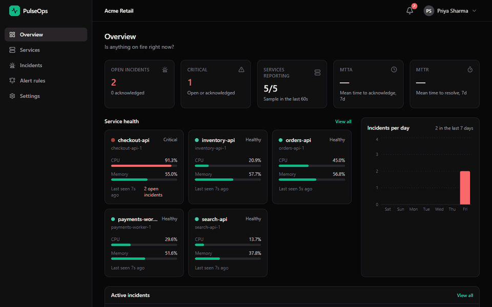

<sub>The overview during a simulated CPU spike: the service turns critical, an incident opens with an AI suggestion, and it resolves itself when CPU recovers. Real recording, not a mock-up.</sub>

</div>

---

## Contents

- [What it does](#what-it-does)
- [Architecture](#architecture) · [component guide](#component-guide) · [life of a sample](#life-of-a-sample) · [incident lifecycle](#incident-lifecycle)
- [Engineering concepts](#engineering-concepts)
- [Screenshots](#screenshots)
- [Measured results](#measured-results)
- [Run it](#run-it)
- [Documentation](#documentation)

---

## What it does

| | |
|---|---|
| **Ingest** | A small agent on each host sends CPU, memory, disk, latency and error rate every few seconds, authenticated with the tenant's API key. |
| **Evaluate** | Alert rules such as *CPU above 85% for 60 s* are checked on the server over a sliding time window. The agent never decides what is "bad". |
| **Deduplicate** | A sustained breach opens **exactly one** incident per service and rule, even with two app instances processing samples in parallel. |
| **Auto-resolve** | When the metric stays healthy for the rule's full window, the incident resolves itself. |
| **Assist** | Gemini proposes a probable root cause and next steps, then drafts a post-mortem after resolution. Both are labelled as suggestions; nothing is executed automatically. |
| **Collaborate** | Engineers acknowledge, add notes and resolve incidents. Changes trigger in-app notifications and optional webhooks. |

---

## Architecture

One Spring Boot application (a **modular monolith**), deployed as **two identical, stateless instances** behind nginx. Kafka is the only asynchronous boundary; PostgreSQL is the source of truth; Redis holds hot, disposable state.

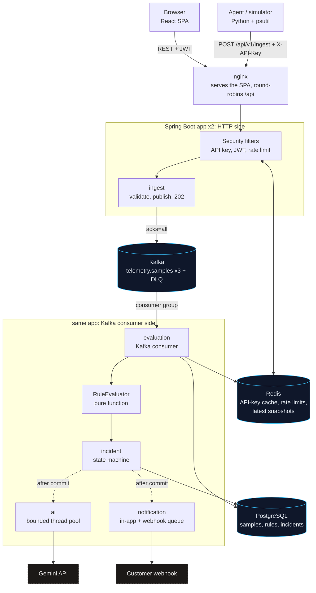

### Component guide

Click a component to expand it.

<details>
<summary><b>Agent and simulator</b> (Python): report numbers, never judge them</summary>

<br>

- [`client-agent/pulseops_agent.py`](client-agent/pulseops_agent.py) reads real CPU, memory and disk with `psutil` and posts one sample every N seconds.
- It sends `recordedAt` with every sample, so a retried request is recognised as a duplicate by the server instead of being counted twice.
- It backs off on network errors, 5xx and `429 Retry-After`, and stops on `401`.
- [`client-agent/simulator.py`](client-agent/simulator.py) fakes several services with scripted scenarios: `cpu-spike`, `memory-leak`, `disk-fill`, and `flood` to show rate limiting.

</details>

<details>
<summary><b>nginx</b>: one URL, two instances</summary>

<br>

- Serves the built React app and proxies `/api`, Swagger and Actuator to the app replicas ([`frontend/nginx.conf`](frontend/nginx.conf)).
- `server app:8080 resolve` re-resolves Docker DNS every 10 s, so it round-robins across every replica.
- `proxy_next_upstream error timeout http_502 http_503` retries on the other replica when one dies. In the failover test, 30 of 30 requests succeeded with one instance stopped.

</details>

<details>
<summary><b>Security filters</b>: two chains for two kinds of caller</summary>

<br>

- **Agents:** `X-API-Key` → SHA-256 → Redis cache → PostgreSQL on a miss ([`ApiKeyAuthFilter`](backend/pulseops/src/main/java/com/pulseops/auth/ApiKeyAuthFilter.java), [`TenantService`](backend/pulseops/src/main/java/com/pulseops/tenant/TenantService.java)).
- **Rate limit:** a per-tenant fixed window in Redis, `INCR` + `EXPIRE` in one atomic Lua script, `429` with `Retry-After` ([`RateLimiter`](backend/pulseops/src/main/java/com/pulseops/ingest/RateLimiter.java)).
- **Dashboard:** a 12-hour HS256 JWT carrying `tenantId` and `role`, verified without a database call ([`JwtService`](backend/pulseops/src/main/java/com/pulseops/auth/JwtService.java)).
- The tenant id **always comes from the credential**, never from the URL or body. Owner-only actions use `@PreAuthorize` ([`SecurityConfig`](backend/pulseops/src/main/java/com/pulseops/config/SecurityConfig.java)).

</details>

<details>
<summary><b>Ingest</b>: fast, lossless, no dual write</summary>

<br>

- Validates the sample, publishes it to Kafka with key `tenantId:service`, waits up to 3 s for the broker's ack, and answers `202` (or `503`, so the agent retries) ([`IngestController`](backend/pulseops/src/main/java/com/pulseops/ingest/IngestController.java), [`SampleProducer`](backend/pulseops/src/main/java/com/pulseops/ingest/SampleProducer.java)).
- There is no database write on this path. Writing to Kafka *and* Postgres in one request would risk the two disagreeing when the second write fails.

</details>

<details>
<summary><b>Kafka</b>: ordering, sharing the work, surviving failures</summary>

<br>

- Topic `telemetry.samples` with 3 partitions. The same key always lands in the same partition, so one service's samples are processed **in order**.
- Consumer group `pulseops-evaluator` splits the partitions across both instances. When one dies, Kafka moves its partitions to the survivor.
- Idempotent producer with `acks=all`. The offset is committed after the DB transaction, giving **at-least-once** delivery.
- Retries with exponential backoff, then a **dead-letter topic**, so one bad message cannot block a partition ([`KafkaConfig`](backend/pulseops/src/main/java/com/pulseops/config/KafkaConfig.java)).

</details>

<details>
<summary><b>Evaluation</b>: one transaction per sample</summary>

<br>

- [`SampleProcessor`](backend/pulseops/src/main/java/com/pulseops/evaluation/SampleProcessor.java) runs in one transaction: upsert the service, insert the sample with `ON CONFLICT DO NOTHING`, load the matching rules, query the time window, evaluate, and open, attach or resolve incidents.
- A duplicate sample inserts 0 rows and is skipped. That makes redelivery harmless.
- [`RuleEvaluator`](backend/pulseops/src/main/java/com/pulseops/evaluation/RuleEvaluator.java) is a pure function with 12 unit tests. "CPU > 85 for 60 s" breaches only if every sample in the window is above 85 **and** the samples really span the window.
- After commit, the latest values go to a Redis hash that the dashboard reads ([`SnapshotStore`](backend/pulseops/src/main/java/com/pulseops/evaluation/SnapshotStore.java)).

</details>

<details>
<summary><b>Incidents</b>: correctness enforced by the database</summary>

<br>

- **Exactly one active incident per service and rule:** a partial unique index plus `INSERT ... ON CONFLICT (service_id, rule_id) WHERE status <> 'RESOLVED' DO NOTHING`. It is atomic across threads and instances ([`IncidentService`](backend/pulseops/src/main/java/com/pulseops/incident/IncidentService.java)).
- **No lost updates:** `@Version` optimistic locking on status changes. A stale click returns `409`.
- Breach counters are updated with atomic SQL increments that don't touch the version, so incoming telemetry never makes an engineer's "Acknowledge" fail.
- Rule details are snapshotted onto the incident, so editing or deleting a rule never rewrites history.

</details>

<details>
<summary><b>AI analysis</b>: slow and fallible, so kept off the critical path</summary>

<br>

- Triggered by an after-commit event. It runs on a **bounded** pool of 2 to 4 threads with a queue of 50. A full queue means FAILED with a Retry button, never a blocked caller ([`AnalysisListener`](backend/pulseops/src/main/java/com/pulseops/ai/AnalysisListener.java)).
- Context comes from the metrics around the incident and the last five similar resolved incidents, retrieved with plain SQL.
- The client has timeouts, retries only on 429, 5xx and network errors (exponential backoff with jitter), and requests structured JSON output ([`GeminiClient`](backend/pulseops/src/main/java/com/pulseops/ai/GeminiClient.java)).
- No transaction is held during the HTTP call. A sweeper turns work stuck by a crash into FAILED.

</details>

<details>
<summary><b>Notifications and webhooks</b>: a job queue on Postgres</summary>

<br>

- Every incident open or resolve creates an in-app notification and, if configured, a row in `webhook_deliveries`.
- Workers on every instance claim rows with `SELECT ... FOR UPDATE SKIP LOCKED`, so deliveries are split, never duplicated ([`WebhookDispatcher`](backend/pulseops/src/main/java/com/pulseops/notification/WebhookDispatcher.java)).
- Failed deliveries retry with exponential backoff up to 5 attempts. Each request carries a stable `Idempotency-Key` header.

</details>

<details>
<summary><b>PostgreSQL</b>: every index maps to a query</summary>

<br>

- Schema is owned by Flyway ([`V1__baseline.sql`](backend/pulseops/src/main/resources/db/migration/V1__baseline.sql)); Hibernate only validates.
- `UNIQUE (service_id, recorded_at)` does double duty: it is the idempotency guarantee and the index behind every window and chart query.
- The partial unique index on incidents is the deduplication rule. `(tenant_id, status, opened_at DESC)` serves the incident list.
- A **BRIN** index on `recorded_at` for retention is 24 kB instead of 168 MB for a B-tree ([measurements](docs/performance.md)).

</details>

<details>
<summary><b>Redis</b>: hot, shared, disposable</summary>

<br>

- **API-key cache** (cache-aside, 15-minute TTL, explicit eviction on key rotation).
- **Rate-limit counters**, shared by both instances.
- **Latest-sample snapshot** per service, with a TTL so dead services drop out.
- If Redis goes down, the cache falls back to Postgres, the rate limiter fails open, and snapshots fall back to SQL. Losing Redis costs latency, not correctness.

</details>

### Life of a sample

From an agent's POST to an incident and an AI suggestion:

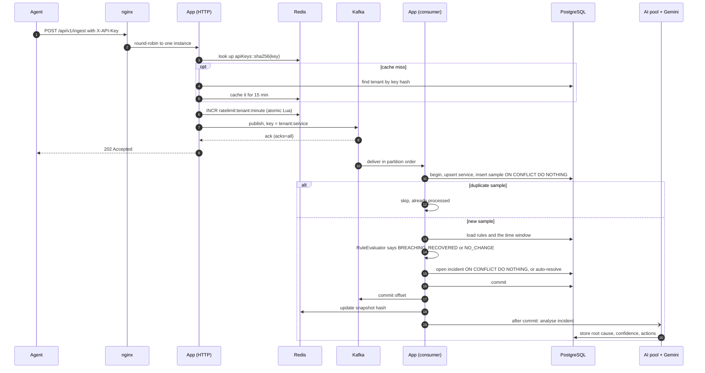

### Incident lifecycle

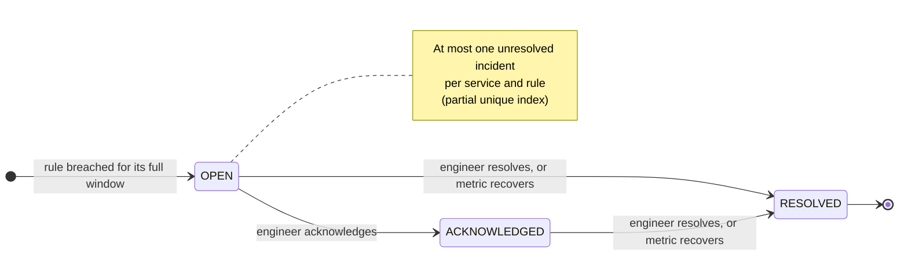

Status changes use optimistic locking. Every change is appended to the incident's timeline, which doubles as an audit log.

---

## Engineering concepts

Each concept is here because the product needs it. [docs/decisions.md](docs/decisions.md) has the reasoning and trade-offs for each one.

| Concept | Where | Problem it solves |
|---|---|---|
| **Queue** with partition keys, consumer groups, retries and a dead-letter topic | [`SampleProducer`](backend/pulseops/src/main/java/com/pulseops/ingest/SampleProducer.java), [`SampleConsumer`](backend/pulseops/src/main/java/com/pulseops/evaluation/SampleConsumer.java), [`KafkaConfig`](backend/pulseops/src/main/java/com/pulseops/config/KafkaConfig.java) | Fast, lossless ingestion when evaluation is slow; per-service ordering; work shared across instances |
| **Idempotency** | unique `(service_id, recorded_at)` + `ON CONFLICT DO NOTHING`; webhook `Idempotency-Key` | At-least-once delivery and retries never double-count |
| **Cache-aside** | [`TenantService`](backend/pulseops/src/main/java/com/pulseops/tenant/TenantService.java) | API key checked on every request without a DB query |
| **Rate limiting** | [`RateLimiter`](backend/pulseops/src/main/java/com/pulseops/ingest/RateLimiter.java) | A misbehaving agent cannot flood the pipeline |
| **Indexes** (composite, partial unique, BRIN) | [`V1__baseline.sql`](backend/pulseops/src/main/resources/db/migration/V1__baseline.sql) | Queries stay fast as samples accumulate ([measured](docs/performance.md)) |
| **Concurrency control in the database** | [`IncidentService`](backend/pulseops/src/main/java/com/pulseops/incident/IncidentService.java), [`Incident`](backend/pulseops/src/main/java/com/pulseops/incident/Incident.java) | Exactly one active incident; no lost updates |
| **Transactions + after-commit side effects** | [`SampleProcessor`](backend/pulseops/src/main/java/com/pulseops/evaluation/SampleProcessor.java), `@TransactionalEventListener` | All-or-nothing processing; slow external calls never hold a DB connection |
| **Failure handling** | [`GeminiClient`](backend/pulseops/src/main/java/com/pulseops/ai/GeminiClient.java), [`AnalysisSweeper`](backend/pulseops/src/main/java/com/pulseops/ai/AnalysisSweeper.java) | An external outage degrades one feature, not the system |
| **Job queue with `SKIP LOCKED`** | [`WebhookDispatcher`](backend/pulseops/src/main/java/com/pulseops/notification/WebhookDispatcher.java) | Instances share outbound work without double-sending |
| **AuthN / AuthZ and tenant isolation** | [`SecurityConfig`](backend/pulseops/src/main/java/com/pulseops/config/SecurityConfig.java) | Tenant always from the credential; owner-only actions |
| **Horizontal scaling** | [`docker-compose.yml`](docker-compose.yml), [`nginx.conf`](frontend/nginx.conf) | Proves no state lives in the JVM ([failover run](docs/scaling-demo.md)) |

Deliberately **not** used: microservices, Kubernetes, a vector database, a chatbot, autonomous remediation, Prometheus/Grafana containers. [Why](docs/decisions.md#what-was-left-out-and-why).

---

## Screenshots

<table>
  <tr>
    <td width="50%"><b>Overview</b>: is anything on fire right now?<br>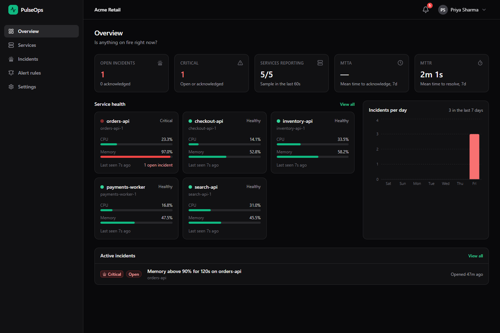</td>
    <td width="50%"><b>Open incident</b>: AI-suggested cause, metric chart, timeline<br>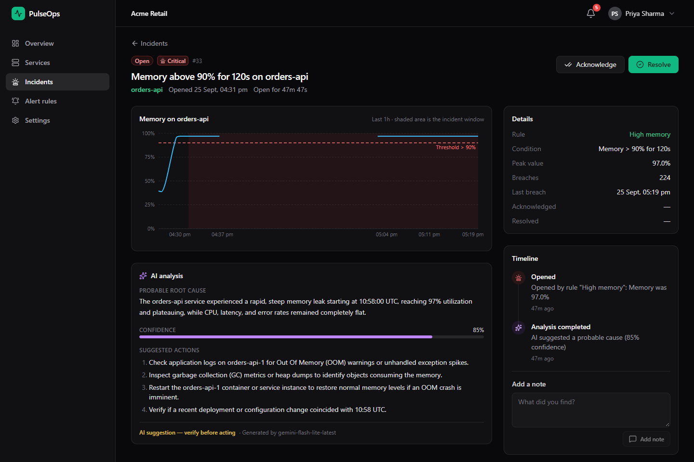</td>
  </tr>
  <tr>
    <td width="50%"><b>Resolved incident</b>: auto-resolved, with a post-mortem draft<br>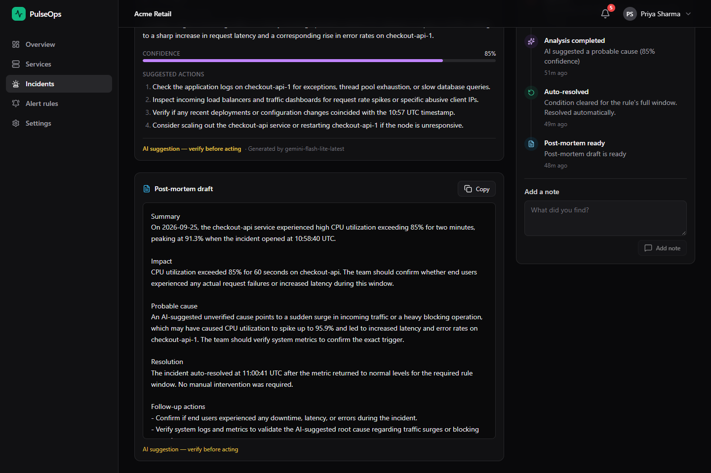</td>
    <td width="50%"><b>Service detail</b>: thresholds as dashed lines, incidents shaded<br>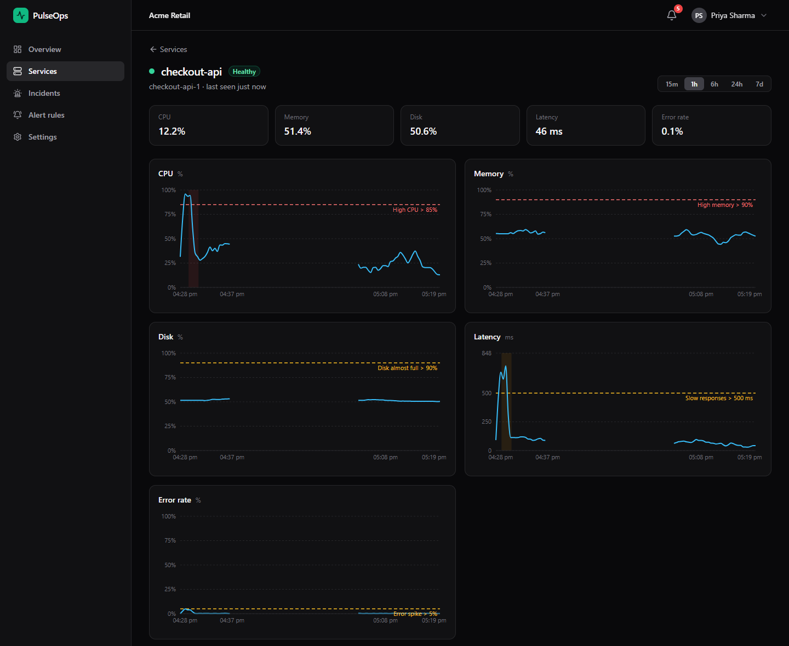</td>
  </tr>
  <tr>
    <td width="50%"><b>Incidents</b>: server-side filters, sorting, pagination<br>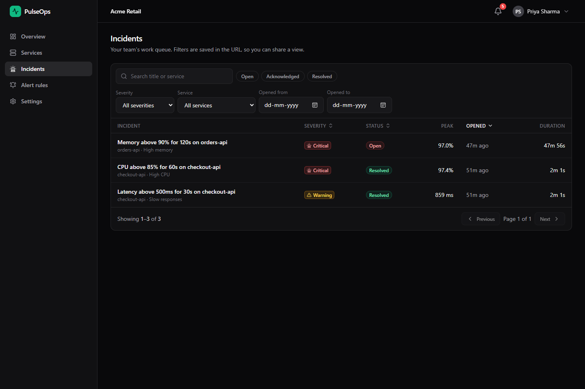</td>
    <td width="50%"><b>Alert rules</b>: create, edit, enable, delete<br>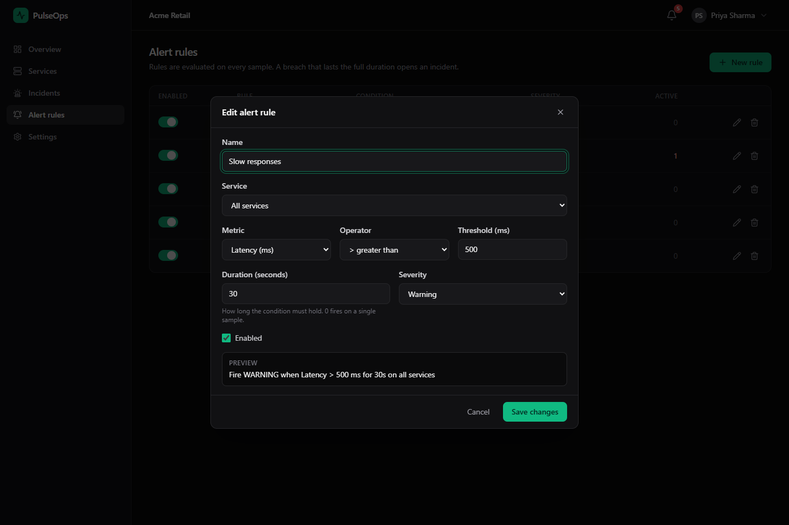</td>
  </tr>
  <tr>
    <td width="50%"><b>Settings</b>: API key rotation, agent install, webhooks<br>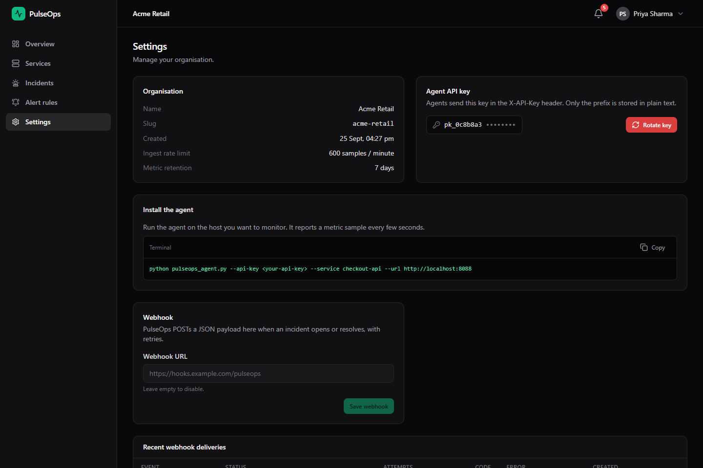</td>
    <td width="50%"><b>Mobile</b>: responsive down to 400 px<br>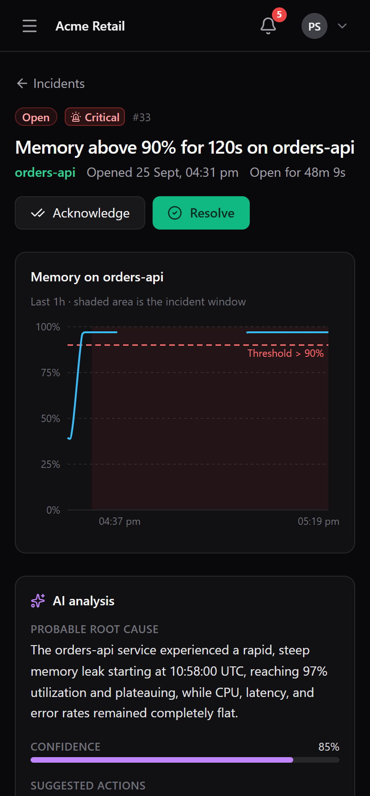</td>
  </tr>
</table>

---

## Measured results

Numbers from real runs, not estimates. Details and reproduction steps are in the linked docs.

| What | Result | Source |
|---|---|---|
| Rule-window query on 2,000,000 samples | **0.29 ms** with the composite index vs 69.8 ms without | [performance.md](docs/performance.md) |
| 1-hour chart aggregation | **0.82 ms** vs 81.2 ms | [performance.md](docs/performance.md) |
| BRIN vs B-tree index size | **24 kB** vs 168 MB | [performance.md](docs/performance.md) |
| One app instance stopped during traffic | **30 / 30** requests succeeded; Kafka moved its partition to the survivor | [scaling-demo.md](docs/scaling-demo.md) |
| Flood of about 4,600 requests in 20 s | limited to the tenant quota, the rest got `429` | [decisions.md](docs/decisions.md) |
| Same 13 samples sent twice | still **one** incident, breach count unchanged | integration test |
| Automated tests | **37** backend (unit + Testcontainers) and 20 browser checks | [tests](#tests) |

---

## Run it

**Prerequisite:** Docker Desktop.

```bash
cp .env.example .env            # set JWT_SECRET; GEMINI_API_KEY is optional
docker compose up -d --build    # postgres, redis, kafka, 2 x app, nginx
```

Open **http://localhost:8088**, create an account, and copy the API key shown once after sign-up. Then generate traffic:

```bash
cd client-agent
pip install -r requirements.txt

# four fake services; checkout-api gets a CPU spike after 30 s that lasts 150 s
python simulator.py --api-key pk_... --scenario cpu-spike --target checkout-api

# or report this machine's real metrics
python pulseops_agent.py --api-key pk_... --service my-laptop
```

Within about a minute of the spike, an incident opens (with an AI suggestion if a Gemini key is set). When the spike ends, it resolves itself and a post-mortem draft appears. Other scenarios: `memory-leak`, `disk-fill`, and `flood` (shows `429` from the rate limiter).

<details>
<summary><b>Scaling and failover demo</b></summary>

<br>

```bash
docker compose ps app                                   # two replicas
docker compose logs app | grep "partitions assigned"    # each replica owns some Kafka partitions
docker stop pulseops-stack-app-2                        # nginx routes around it, Kafka rebalances
docker start pulseops-stack-app-2
```

A full walkthrough with real output is in [docs/scaling-demo.md](docs/scaling-demo.md).

</details>

<details>
<summary><b>Local development without Docker for the app</b></summary>

<br>

```bash
docker compose up -d postgres redis kafka
cd backend/pulseops && mvn spring-boot:run -Dspring-boot.run.profiles=local   # :8080
cd frontend && npm install && npm run dev                                     # :5173, proxies /api to :8080
```

API docs: http://localhost:8080/swagger-ui.html (or via nginx at http://localhost:8088/swagger-ui.html). Contract: [docs/API.md](docs/API.md).

</details>

### Tests

```bash
cd backend/pulseops && mvn verify   # unit tests + Testcontainers integration tests (needs Docker)
cd frontend && npm run lint && npm run build
```

- **Unit:** the rule evaluator, the incident state machine, API keys, AI response parsing, and the Gemini client against a stub HTTP server (retry, no retry, timeout).
- **Integration** (real PostgreSQL, Kafka and Redis in containers): incident open and dedup under repeated breaches, duplicate-sample idempotency, auto-resolve, tenant isolation, optimistic locking, owner-only actions (`403`), validation errors, rate limiting, and API key rotation.

---

## Documentation

| Document | What it covers |
|---|---|
| [docs/decisions.md](docs/decisions.md) | Each architecture decision, its alternatives and its cost; what was left out and why |
| [docs/performance.md](docs/performance.md) | Index experiment on 2 million rows with `EXPLAIN ANALYZE` (script in [`docs/perf/`](docs/perf/explain.sql)) |
| [docs/scaling-demo.md](docs/scaling-demo.md) | Two instances, Kafka partition assignment, failover run |
| [docs/API.md](docs/API.md) | REST contract |

### Repository layout

```
backend/pulseops/        Spring Boot application (one deployable)
  src/main/java/com/pulseops/
    auth/                users, JWT, API-key filter
    tenant/              tenants, API keys, settings
    ingest/              ingest endpoint, Kafka producer, rate limiter
    evaluation/          Kafka consumer, rule evaluator, sample store, Redis snapshot, retention
    rules/               alert rules
    incident/            incident state machine, timeline, queries, overview
    ai/                  Gemini client, analysis and post-mortem
    notification/        in-app notifications, webhook dispatcher
    services/            monitored services, health and metrics API
    config/ common/      Kafka, Redis, security, error handling
  src/main/resources/db/migration/   Flyway schema
frontend/                React SPA + nginx config
client-agent/            agent and simulator (Python)
docs/                    decisions, performance, scaling demo, API contract, images
```
